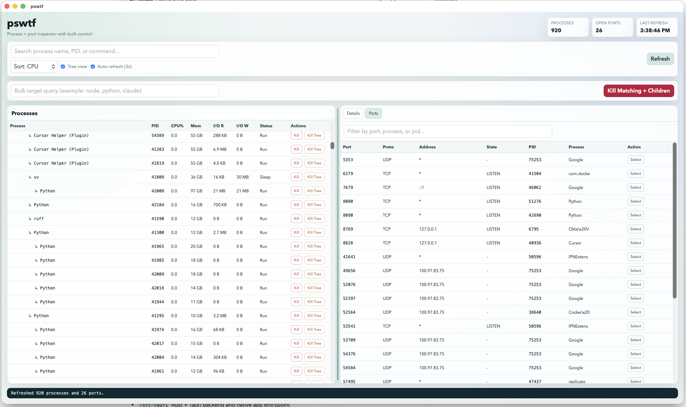

# pswtf - ps wtf???



`pswtf` is a greenfield desktop app for macOS built with:
- Rust + Tauri (native desktop shell)
- Plain HTML/CSS/JavaScript (UI)

## What it does

- Lists running processes with:
  - PID / parent PID
  - CPU usage
  - memory
  - I/O bytes read/written
  - runtime + status
- Supports process search (name, pid, command, status)
- Supports tree view (parent/child process hierarchy)
- Shows per-process details:
  - executable path
  - command
  - working directory
  - open file handle count (via `lsof`)
- Lists open ports and maps each port to PID/process
- Lets you jump from a port row to its process details
- Kill actions:
  - kill one process
  - kill one process tree
  - bulk kill by query (for patterns like `node`, `python`, `claude`, etc)

## Install

Download the latest DMG from the [v1.0.0 release](https://github.com/iguana/pswtf/releases/tag/v1.0.0), open it, and drag pswtf to your Applications folder.

## Development

### Project layout

- `/src-tauri` Rust + Tauri backend and native app entrypoint
- `/ui` Static frontend loaded by Tauri webview

### Prereqs

- Rust toolchain (`rustup`, `cargo`)
- `lsof` (already present on macOS)
- Tauri CLI:

```bash
cargo install tauri-cli --version '^1'
```

If you do not have full Xcode installed, this stack still avoids Xcode IDE projects. Some macOS builds still require Apple Command Line Tools (`xcode-select --install`).

### Dev run

From repo root:

```bash
cargo tauri dev
```

Alternative launch without the tauri CLI helper:

```bash
cargo run --manifest-path src-tauri/Cargo.toml
```

### Build a macOS app bundle

```bash
cargo tauri build
```

This produces a packaged app/bundle under `src-tauri/target`.

### Notes

- Process and port snapshots refresh every 3 seconds by default (toggleable).
- Kill operations use `SIGTERM` by default.
- `open file handles` and `ports` data are gathered via `lsof`, so visibility depends on current process permissions.
